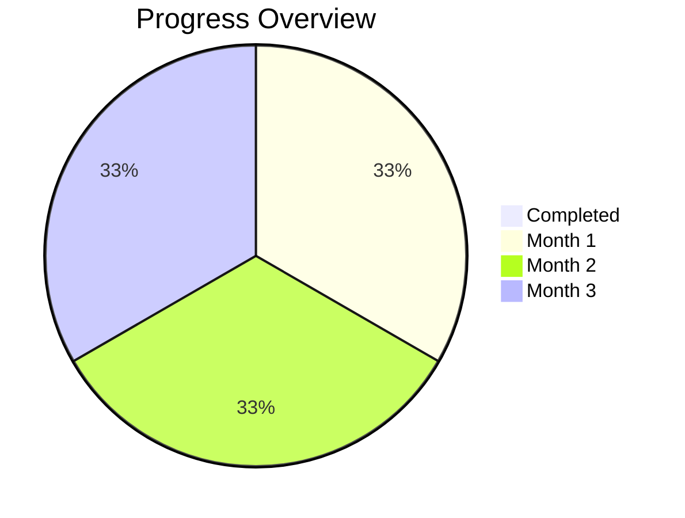

# Tháng 1 – Nền tảng phần cứng & OCR cơ bản

## Tuần 1

### Cụm ESP32-CAM

- Flash và kiểm thử camera.
- Viết code chụp ảnh, crop vùng số.
- Test tốc độ capture và tiêu thụ pin.
- Setup đọc sensor DHT22.

### Cụm LoRa Client

- Cấu hình module LoRa RA-02.
- Test giao tiếp SPI giữa ESP32 ↔ LoRa.
- Gửi gói tin "hello world".
- Đo mức tiêu thụ LoRa.

### Cụm OCR Dataset

- Sinh dataset digit synthetic nhiều font.
- Thu thập ảnh thực tế từ đồng hồ.
- Label thủ công vài mẫu thật.
- Chuẩn hóa ảnh về 28x28 grayscale.

### Cụm Server chuẩn bị

- Setup Raspberry Pi OS.
- Cài LoRa gateway driver.
- Setup XAMPP (Apache + MySQL + PHP).
- Thiết kế sơ đồ DB đơn giản (readings, devices).

## Tuần 2

### ESP32-CAM

- Code crop động bằng webserver.
- Resize ảnh về input CNN.
- Benchmark tốc độ inference giả lập.
- Viết logic capture nhiều frame/lần.

### LoRa Client

- Định nghĩa packet format (ID, data, ts).
- Thử gửi OCR dummy data.
- Thử gửi dữ liệu DHT22.
- Kiểm tra lỗi mất gói.

### OCR Model

- Train CNN nhỏ (LeNet-like).
- Đánh giá accuracy trên dataset synthetic.
- Thêm augmentation (blur, contrast).
- Export model sang TFLite Micro.

### Server

- Viết script nhận packet LoRa.
- Parse gói tin sang JSON.
- Lưu dữ liệu vào MySQL.
- Tạo API REST GET/POST readings.

## Tuần 3

### ESP32-CAM

- Tối ưu chụp ảnh nhanh hơn.
- Thử ESP32 sleep/wake.
- Test runtime với pin.
- Xử lý OCR fail liên tiếp.

### LoRa Client

- Bổ sung ACK/NACK.
- Retry khi mất gói.
- Đóng gói nhiều sensor (OCR + DHT22).
- Tối ưu payload nhỏ gọn.

### OCR Model

- Test inference nhiều digit nối tiếp.
- Optimize quantization INT8.
- Kiểm thử tốc độ trên ESP32.
- Đánh giá accuracy thực tế.

### Server

- Viết giao diện web backend hiển thị bảng readings.
- Biểu đồ đơn giản mức tiêu thụ theo thời gian.
- Thêm auth token API.
- Kiểm tra latency end-to-end.

## Tuần 4

### ESP32-CAM

- Thiết kế mạch in tạm (ESP32 + LoRa + DHT22).
- Test hoạt động trên PCB.
- Đo nhiệt độ chip ESP32.
- Debug power supply.

### LoRa Client

- Test truyền dữ liệu 24h.
- Ghi log tỉ lệ mất gói.
- Cân nhắc sleep mode tiết kiệm pin.
- Test LoRa phạm vi xa.

### OCR Model

- Huấn luyện thêm với case "digit trắng/nửa vời".
- Output softmax cho mỗi digit.
- Thử rule "digit ±1 so với trước".
- Viết pseudo-code xử lý lỗi OCR.

### Server

- Lưu timestamp chính xác.
- API lấy dữ liệu theo ngày/tuần.
- Export CSV.
- Thêm trang quản lý device.

# Tháng 2 – Xử lý hình ảnh nâng cao và tối ưu dữ liệu

## Tuần 5

### ESP32-CAM

- Viết thuật toán nhận diện OCR trắng.
- Áp dụng dự đoán từ giá trị trước.
- Thử voting nhiều frame/lần.
- Giới hạn bước nhảy ≤ 1.

### LoRa Client

- Chuẩn hóa format số liệu (float, int).
- Thêm checksum CRC.
- Test lại với dữ liệu thật.
- Xử lý duplicate packet.

### OCR Model

- Fine-tune trên ảnh thực tế từ đồng hồ.
- Evaluate confusion matrix.
- Thêm threshold xác suất.
- Optimize model size < 150KB.
- Benchmark model performance.
- Document training results.

### Server

- Viết API trả về dữ liệu theo device.
- API báo lỗi nếu dữ liệu nhảy ngược.
- Lưu log lỗi OCR trắng.
- Hiển thị biểu đồ debug OCR accuracy.

## Tuần 6

### ESP32-CAM

- Tích hợp CNN vào firmware.
- Chạy inference 1 digit.
- Hiển thị log kết quả OCR.
- Đo RAM/Flash sử dụng.

### LoRa Client

- Thử gửi nhiều client → 1 server.
- Gán ID duy nhất cho device.
- Test mức tiêu thụ với DHT22 + OCR.
- Tối ưu duty cycle LoRa.

### Thuật toán OCR nâng cao

- Bắt đầu fine-tuning với dataset thực tế.
- Thử multiple model architectures (MobileNet, EfficientNet).
- Benchmark tốc độ training và convergence.
- Analyze overfitting/underfitting patterns.

### Server

- Viết service xử lý dữ liệu nền (cronjob).
- Tính lượng nước tiêu thụ giữa 2 lần đọc.
- Lưu log daily consumption.
- Tạo API cho app lấy daily usage.

## Tuần 7

### ESP32-CAM

- Thêm rule xác nhận bằng kim phụ (nếu OCR mờ).
- Cache 3 lần đọc gần nhất.
- Phát hiện digit rollover (9→0).
- Xuất dữ liệu cuối cùng qua LoRa.

### LoRa Client

- Test môi trường ngoài trời.
- Đo RSSI, SNR.
- Thử anten khác.
- Benchmark throughput.

### Thuật toán OCR và xử lý ảnh

- Bổ sung training với noise ánh sáng komplex.
- Thử denoise filter phức tạp hơn (wavelet, bilateral).
- Test robustness với multiple rotations và distortions.
- Log accuracy theo điều kiện môi trường chi tiết.

### Server

- Bổ sung kiểm tra bất thường (jump > ngưỡng).
- API cảnh báo khi phát hiện anomaly.
- Lưu flag anomaly vào DB.
- Gửi email/log cảnh báo test.

## Tuần 8

### ESP32-CAM

- Xử lý buffer nhiều frame.
- Thêm detection khi OCR fail (trắng/no digit).
- Rule giữ giá trị trước đó.
- Log dữ liệu debug qua UART.

### LoRa Client

- Test truyền dữ liệu PCB thật.
- So sánh với breadboard.
- Kiểm tra độ ổn định pin.
- Thử module sạc TP4056.

### Phát triển module CNN OCR

- Gom thêm dataset từ môi trường đa dạng.
- Re-train model với dataset mở rộng.
- Optimize hyperparameters adamant (learning rate, batch size).
- Benchmark model size và inference time.

### Server

- Triển khai dashboard web rõ ràng.
- Thêm chart real-time.
- API cho mobile app.
- Bảo mật basic (password).

# Tháng 3 – Cảnh báo và tích hợp hệ thống

## Tuần 9

### ESP32-CAM

- Stress test OCR nhiều ngày.
- Thêm log flash nội bộ.
- Kiểm thử reset tự động khi crash.
- Chuẩn hóa packet OCR + DHT22.

### LoRa Client

- Test hệ thống nhiều node song song.
- Log data loss % khi traffic nhiều.
- Tối ưu packet scheduler.
- Thêm khả năng gửi lại dữ liệu cũ.

### Phiên bản nâng cao module OCR

- Lặp lại training với augmented dataset.
- Thử transfer learning từ pre-trained models.
- Optimize model cho edge deployment.
- Benchmark accuracy trên tập validation mở rộng.

### Server

- Triển khai module cảnh báo rò rỉ (threshold consumption).
- Gửi cảnh báo qua API/app.
- Log sự kiện cảnh báo vào DB.
- Dashboard hiển thị báo động đỏ.

## Tuần 10

### ESP32-CAM

- Chỉnh sleep/wake để tiết kiệm pin.
- Đo battery runtime thực tế.
- Debug issue OCR trắng còn sót.
- Xuất release firmware v1.

### LoRa Client

- Test hoạt động xa (100–500m).
- Benchmark tốc độ gói tin.
- Kiểm thử pin nhiều ngày.
- Thêm chế độ tiết kiệm năng lượng.

### Triển khai và tối ưu model OCR

- Tối ưu quantization cho độ chính xác.
- Benchmark resource usage detailed.
- Compare model performance trên different hardware.
- Integrate model into final firmware.

### Server

- Triển khai báo cáo tuần/tháng.
- Tính toán chi phí nước.
- API tổng hợp dữ liệu cho app.
- Log uptime server.

## Tuần 11

### ESP32-CAM

- Test ngoài trời thật 7 ngày.
- Kiểm tra ảnh chụp ban ngày/ban đêm.
- Debug ánh sáng yếu.
- Thêm filter contrast.

### LoRa Client

- Stress test nhiều packet.
- Tối ưu sleep/awake LoRa.
- Thử mode SF khác nhau.
- Đánh giá pin trong môi trường thực tế.

### Đánh giá kỹ thuật module OCR

- Comprehensive evaluation trên diverse test sets.
- Analyze failure cases và cải thiện.
- Fine-tune threshold với metrics chính xác.
- Prepare model cho production.

### Server

- Triển khai hệ thống cảnh báo push (noti/email).
- Lưu log cảnh báo chi tiết.
- Test app client hiển thị cảnh báo.
- Kiểm thử 20 case bất thường.

## Tuần 12

### ESP32-CAM

- Tổng hợp firmware final.
- Viết tài liệu hướng dẫn cài đặt.
- Xuất bản mã nguồn.
- Chuẩn bị bản demo.

### LoRa Client

- Chuẩn hóa tài liệu phần cứng.
- Ghi BOM linh kiện.
- Chuẩn hóa sơ đồ PCB.
- Xuất bản code client.

### Hoàn thiện và triển khai module OCR

- Viết tài liệu training pipeline chi tiết.
- Lưu dataset + model final với versioning.
- Xuất báo cáo accuracy comprehensive.
- Tạo guideline retrain và maintain model.

### Server

- Hoàn thiện backend.
- Xuất bản API doc.
- Đóng gói app client test.
- Chuẩn bị slide demo toàn hệ thống.

# Extended Timing

To extend the development time for OCR algorithm and image processing within the 3-month timeframe, incorporate the following recurring tasks throughout months 2 and 3 to add more duration for iterative testing and validation.

## Recurring OCR Tasks (Add to each week in Month 2 and 3)

- Re-evaluate model performance on the current dataset.
- Test model on additional images from the same environment.
- Document accuracy metrics and identify any issues.
- Optimize model size if necessary.
- Benchmark inference time after any changes.

## Recurring Image Processing Tasks (Add to ESP32-CAM cluster each week in Month 2 and 3)

- Capture additional images and test crop functionality.
- Validate image preprocessing pipeline.
- Measure impact on OCR accuracy.
- Log debug information for any failures.
- Tune parameters based on environmental conditions.

This approach extends the time horizon for algorithm development and image processing while keeping the technical complexity the same since only one environment is tested.

# Charts

## Progress Chart Progress



## Development Timeline

```mermaid
gantt
    title Project Development Timeline
    dateFormat  YYYY-MM-DD
    section Foundation (Month 1)
    Hardware Setup & Test    :done, f1, 2025-01-01, 30d
    OCR Dataset Prep    :done, f2, 2025-01-01, 30d
    Basic Server Setup    :done, s1, 2025-01-01, 30d
    Integration & Testing    :done, s2, 2025-01-01, 30d
    section Enhancement (Month 2)
    Advanced OCR & LoRa    :active, e1, 2025-02-01, 30d
    Data Processing    :active, e2, 2025-02-01, 30d
    Web Dashboard    :active, w1, 2025-02-01, 30d
    section Finalization (Month 3)
    Alert System    :crit, af1, 2025-03-01, 30d
    Full Integration    :crit, af2, 2025-03-01, 30d
    Demo Preparation    :crit, af3, 2025-03-01, 30d
